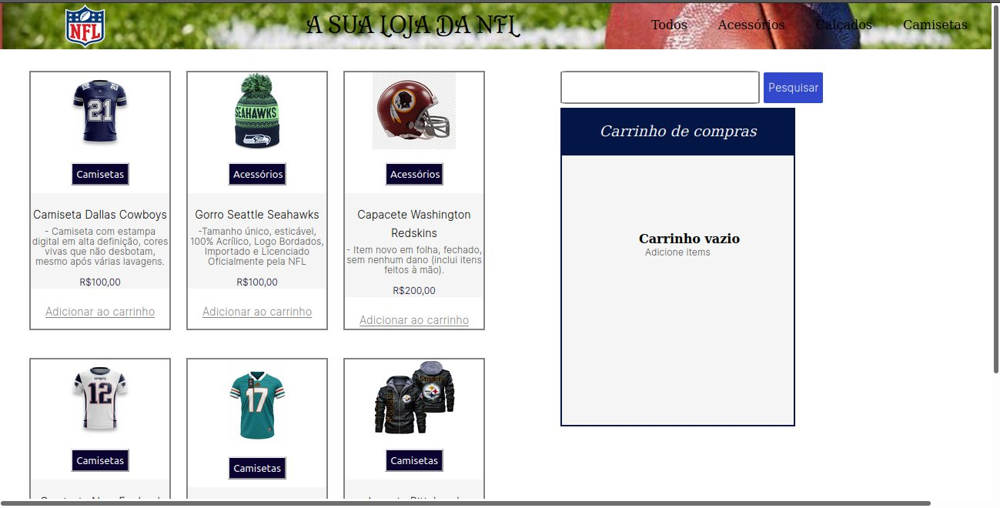

# Vitrine E-commerce NFL

## Sobre o projeto

Este projeto foi criado para colocar em prática os conhecimentos adquiridos no curso de desenvolvimento full-stack da **Kenzie Academy** para o aprendizado **front-end**.

As linguagens utilizadas neste projeto foram:
* HTML
* CSS

O objetivo do projeto foi desenvolver um ecommerce em mobile first, aprender a estruturar um layout, usar as técnicas do CSS3 com contêineres e variáveis, como utilizar o posicionamento Flexbox e como utilizar media queries.

### Layout do projeto

# Autor

**Giuliane Camilo**

LinkedIn: https://www.linkedin.com/in/giulianecamilo/
